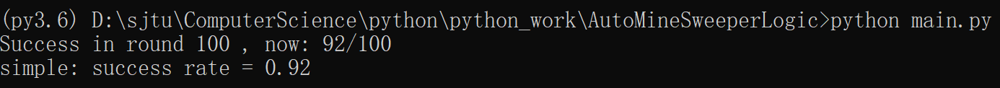

# Auto-MineSweeper
Using logic deduction to solve the minesweeper game

Parts of the codes come from U.C.Berkeley's course project in cs188
* agents.py
* logic.py
* logic_utils.py
* util.py
* part of logicPlan.py

**updated in 14th July 2022:**
brute cnf version

using global cnf to deduct the location of mines

achieve a winning rate of 92/100 in simple version of MineSweeper

**updated in 15th July 2022:**

add local cnf search and scanning

**demo video in ./video/demo.mp4**
